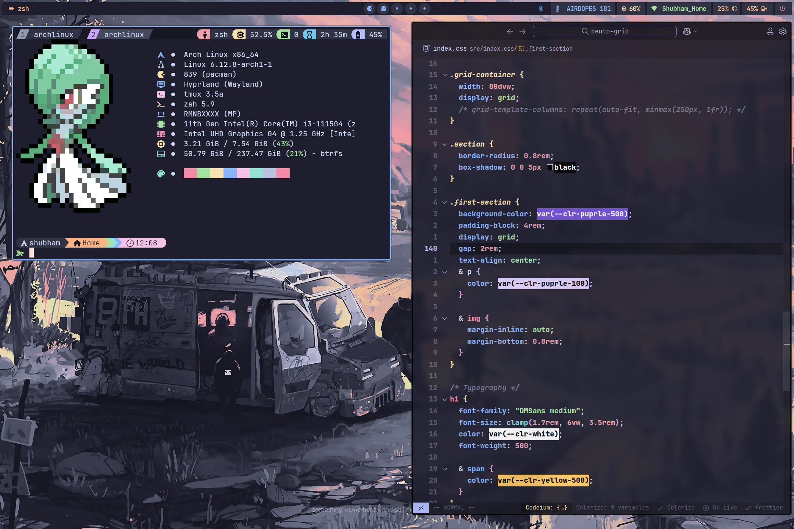
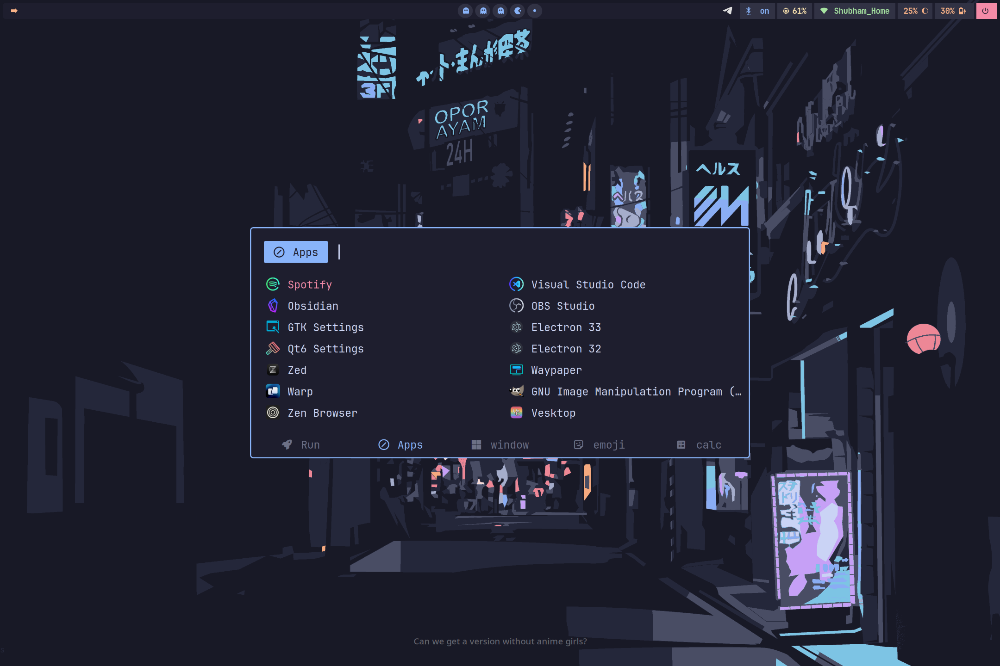
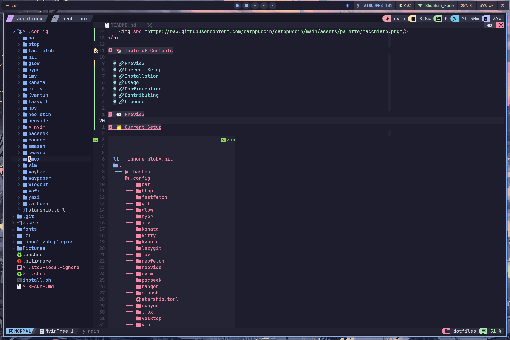
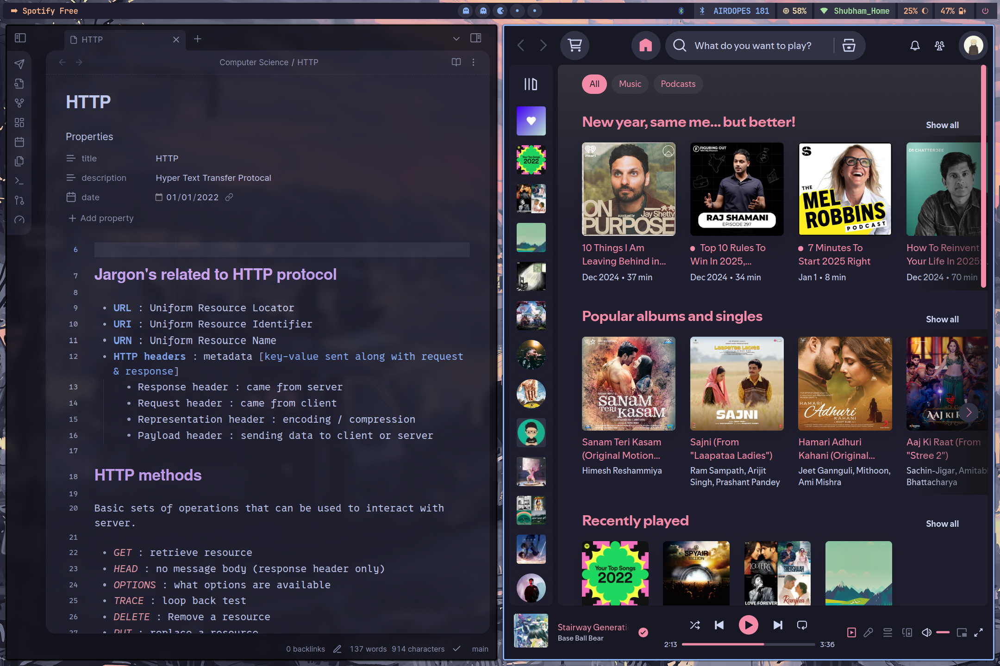
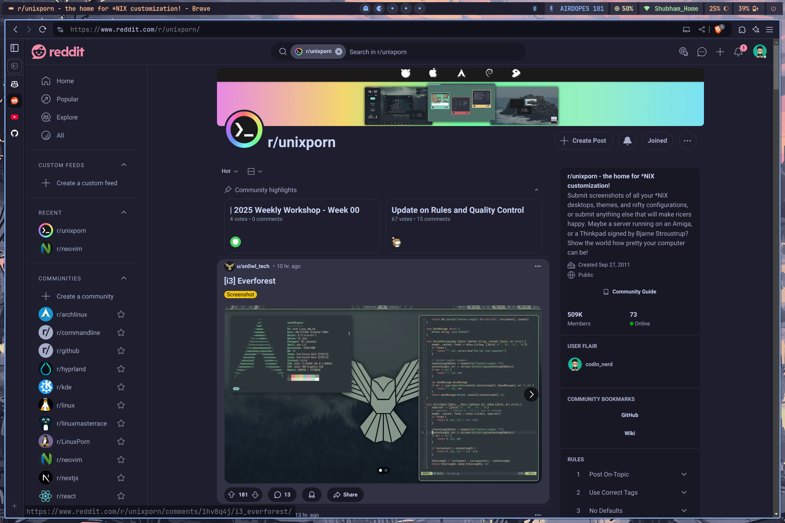
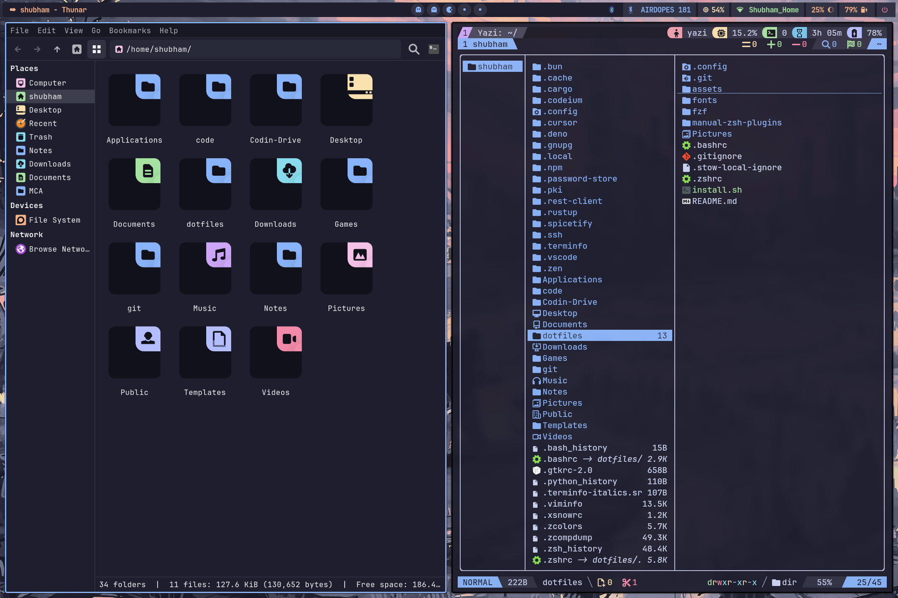
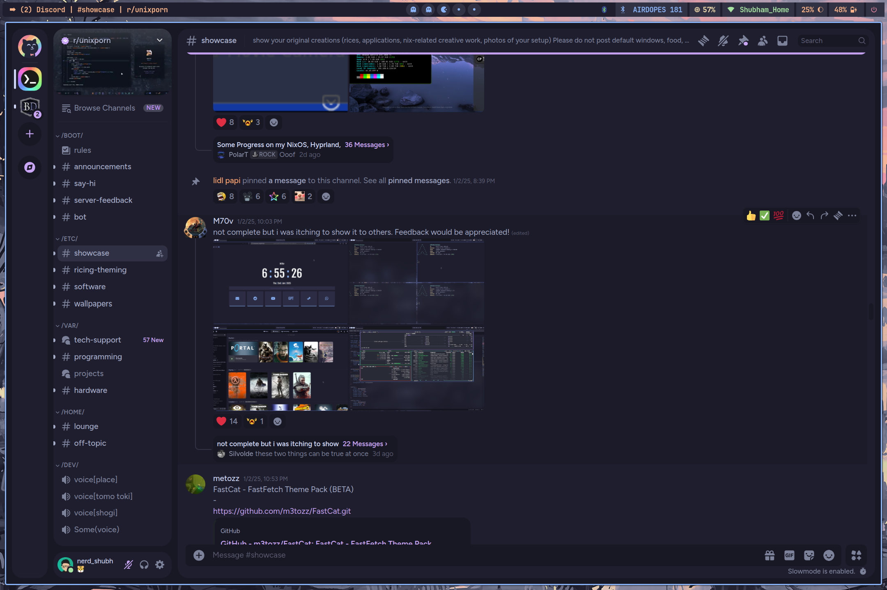

<!--toc:start-->

- [📚 Table of Contents](#📚-table-of-contents)
- [📦 Programs](#📦-programs)
- [👀 Preview](#👀-preview)
- [Quick Start](#quick-start)
  - [Prerequisites](#prerequisites)
  - [Installation](#installation)
  <!--toc:end-->

<h1 align="center"> 🌟 Hyprland-Arch Config in Catppuccin_mocha</h1>



A decent configuration setup for my personal [arch linux](https://archlinux.org/) desktop with [hypland](https://hyprland.org/) window manager in my favourite theme [catppuccin](https://github.com/catppuccin/catppuccin)

<p align="center">
    
</p>

## 📚 Table of Contents

- [Programs](#📦-programs)
- [Preview](#👀-preview)
- [Installation](#installation)
- [License](#license)

## 📦 Programs

List of programs and tools I use

| Component         | Program                                                                                                           |
| ----------------- | ----------------------------------------------------------------------------------------------------------------- |
| Window Manager 🪟 | [Hyprland](github.com/hyprwm/Hyprland)                                                                            |
| Terminal          | [Kitty](github.com/kovidgoyal/kitty) / [warp](app.warp.dev)                                                       |
| Shell / prompt    | [zsh](wiki.archlinux.org/title/Zsh) / [starship](starship.rs)                                                     |
| Multiplexer       | [tmux](github.com/tmux/tmux)                                                                                      |
| Font              | [JetBrains Mono](jetbrains.com/lp/mono/)                                                                          |
| Fetch             | [fastfetch](github.com/fastfetch-cli/fastfetch) / [pokeget](github.com/talwat/pokeget-rs)                         |
| File Manager      | [yazi](yazi-rs.github.io/) / [thunar](wiki.archlinux.org/title/Thunar)                                            |
| Editor            | [neovim](neovim.io) / [nvChad](github.com/nvChad) /[vscode](wiki.archlinux.org/title/Visual_Studio_Code)          |
| Browser           | [Brave](brave.com) / [zen](zen-browser.app)                                                                       |
| Discord           | [Vesktop](github.com/1j01/vesktop)                                                                                |
| Bar               | [waybar](github.com/Alexays/Waybar)                                                                               |
| Launcher          | [rofi](github.com/davatorium/rofi)                                                                                |
| Colorscheme       | [catppuccin](github.com/catppuccin/catppuccin)                                                                    |
| Notification      | [dunst](dunst-project.org)                                                                                        |
| Lockscreen        | [hyprlock](github.com/hyprwm/hyprlock)                                                                            |
| Display Manager   | [sddm](wiki.archlinux.org/title/sddm)                                                                             |
| Music Player      | [Spotify](spotify.com) / [spicetify](spicetify.app)                                                               |
| Visualizer        | [cava](github.com/karlstav/cava)                                                                                  |
| Media Player      | [mpv](mpv.io)                                                                                                     |
| Screenshot        | [flameshot](flameshot.org)                                                                                        |
| Notes             | [Obsidian](https://obsidian.md)                                                                                   |
| pdf reader        | [zathura](pwmt.org/projects/zathura/)                                                                             |
| Others            | [bat](github.com/sharkdp/bat) / [exa](github.com/ogham/exa) / [fd](github.com/sharkdp/fd) / [ripgrep](github.com) |

## 👀 Preview

<details>
    <summary>Desktop</summary>



</details>

<details>
    <summary>fastfetch</summary>


</details>

<details>
<summary>Neovim</summary>



</details>

<details>
    <summary>spotify</summary>



</details>
<details>
    <summary>Browser</summary>



</details>

<details>
    <summary>File manager</summary>



</details>
<details>
    <summary>Disord</summary>



</details>

## Quick Start

### Prerequisites

This configuration is only for Arch linux. Make sure you have these packages installed:

```zsh
# install required packages
sudo pacman -S git stow base-devel
```

### Installation

Clone and setup the configuration:

```zsh
# Clone the repository
git clone https://github.com/xshubhamg/dotfiles ~

# Navigate to the directory
cd ~/dotfiles

# Make the install script executable
chmod +x install.sh

# Run the installation script
./install.sh
```

<p align="center">
 
</p>

<p align="center">
 <a href="https://github.com/xshubhamg/xshubhamg/LICENSE"></a>
</p>
